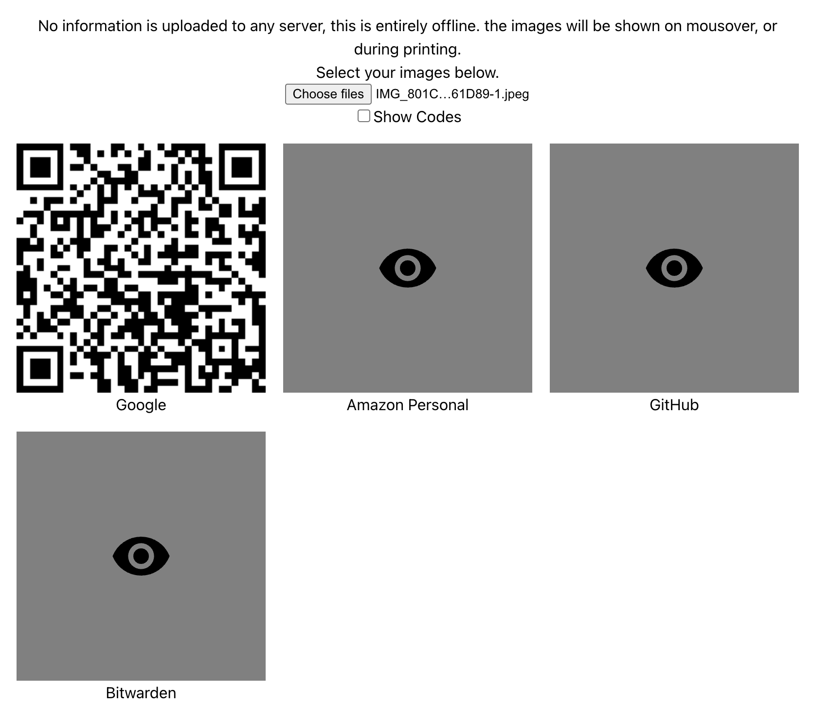

# Google Authenticator Exporter

> [!IMPORTANT]
> This web app works entirely offline and entirely within the client.

A small web app for converting the Google Authenticator export QR codes into generic 2FA import QR codes.

https://rmp135.github.io/GoogleAuthExporter/

## How to Use

1. In Google Authenticator, click the menu -> Transfer accounts -> Export accounts. 
1. Screenshot each of the QR codes generated.
1. In this web app, selected every exported png file. 

The codes will load obscured and will be shown on mouseover.

Click "Show Codes" to show the actual TOTP code for manually importing.

Printing the page will show all QR codes.

Thanks to [krissrex/google-authenticator-exporter](https://github.com/krissrex/google-authenticator-exporter) for the logic on exporting the data from the Google QR.